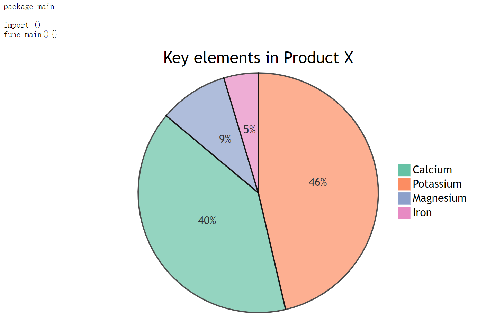
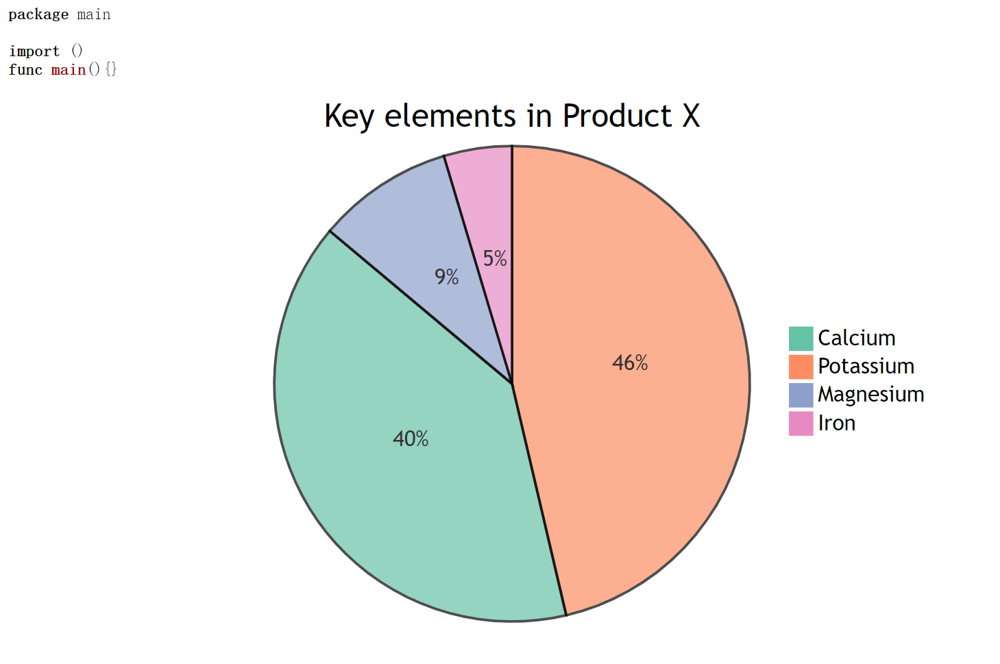

# goldmark-mermaid

[](https://gitee.com/OhYee/goldmark-mermaid) [](https://github.com/OhYee/goldmark-mermaid/actions) [](https://codecov.io/gh/OhYee/goldmark-mermaid) [](https://github.com/OhYee/goldmark-mermaid/tags)

goldmark-mermaid is an extension for [goldmark](https://github.com/yuin/goldmark).  

You can use [mermaid](https://github.com/mermaid-js/mermaid) to build svg image in your markdown like [mume](https://github.com/shd101wyy/mume)

## screenshot

There are two demo(using `'` instead of &#8242; in the code block)

1. default config

[Demo1](demo/demo1/main.go)
[Output1](demo/demo1/output.html)

```markdown
'''go
package main

import ()

func main(){}
'''

'''mermaid
pie
    title Key elements in Product X
    "Calcium" : 42.96
    "Potassium" : 50.05
    "Magnesium" : 10.01
    "Iron" :  5
'''
```



2. using `mermaid-svg` and [goldmark-highlighting extension](https://github.com/yuin/goldmark-highlighting)

[Demo2](demo/demo1/main.go)
[Output2](demo/demo1/output.html)

```markdown
'''go
package main

import ()

func main(){}
'''

'''mermaid-svg
pie
    title Key elements in Product X
    "Calcium" : 42.96
    "Potassium" : 50.05
    "Magnesium" : 10.01
    "Iron" :  5
'''
```



## Installation

```bash
go get -u github.com/OhYee/goldmark-mermaid
```

## License

[MIT](LICENSE)
